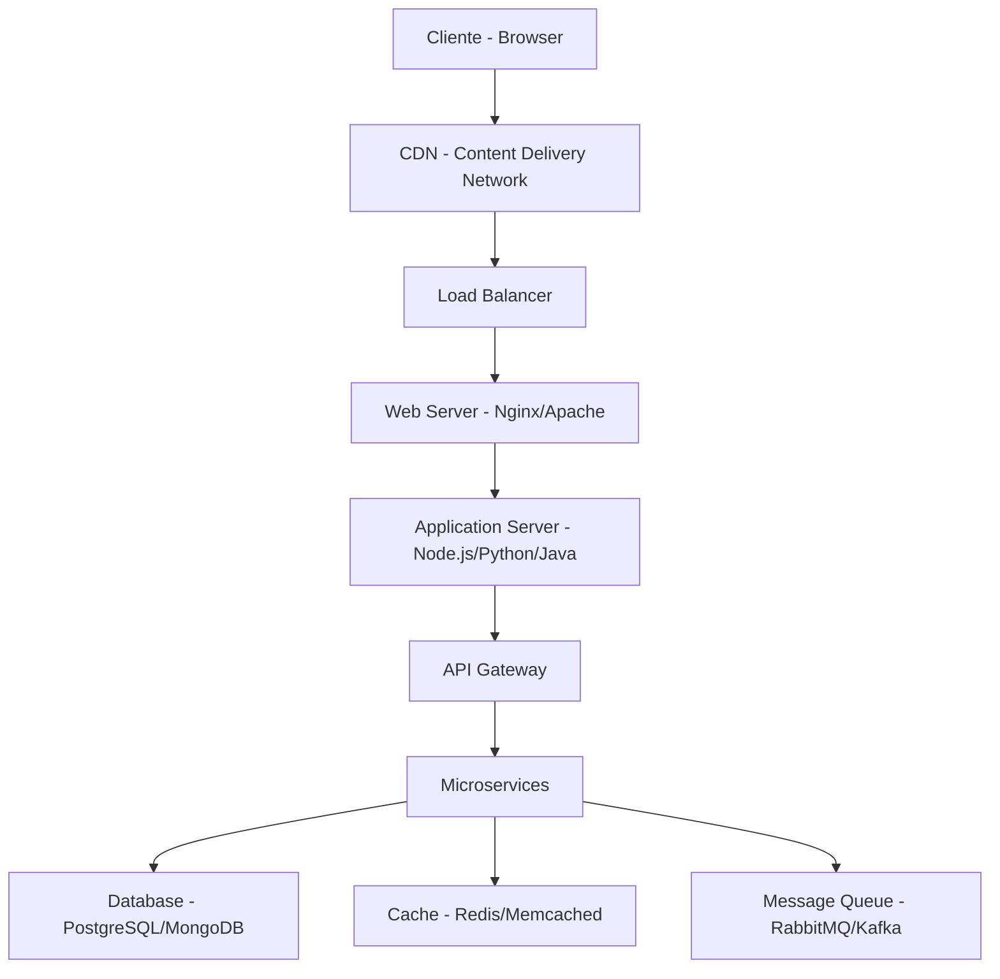

# 🎓 **Web Fundamentals - Nível Avançado**

## 📚 **Aula 01 - Módulo 01: Introdução ao Desenvolvimento Web Moderno**

### 🎯 **Objetivos de Aprendizado**
- ✅ Compreender a evolução histórica e arquitetura da web moderna
- ✅ Dominar os pilares fundamentais: HTML5, CSS3 e JavaScript ES6+
- ✅ Entender o ecossistema de desenvolvimento web atual
- ✅ Configurar ambiente de desenvolvimento profissional
- ✅ Aplicar melhores práticas e padrões da indústria

**Duração Estimada:** 75 min  
**Nível:** Avançado  
**Tipo:** Text  
**Pré-requisitos:** Conhecimento básico de programação

---

## 🌟 **INTRODUÇÃO AO TÓPICO**

### 🎬 **Hook Visual e Contexto**
Imagine que você está construindo a próxima grande aplicação web que vai revolucionar o mercado brasileiro. Para isso, você precisa dominar as tecnologias modernas que formam a base de toda a web atual. Esta aula é o seu ponto de partida para se tornar um desenvolvedor web de elite!

### 📋 **Agenda da Aula**
1. **Evolução da Web** → História e transformações → Tecnologias atuais
2. **Pilares Fundamentais** → HTML5, CSS3, JavaScript → Integração moderna
3. **Ecossistema Atual** → Frameworks, ferramentas → Stack tecnológico
4. **Setup Profissional** → Ambiente de desenvolvimento → Deploy moderno

---

## 🏗️ **DESENVOLVIMENTO DOS CONCEITOS**

### 1️⃣ **A Evolução da Web e Arquitetura Moderna**

#### **1.1 História e Transformações da Web**

A web passou por transformações revolucionárias desde sua criação em 1989 por Tim Berners-Lee:

**Era 1.0 - Web Estática (1990-2000)**
- Páginas HTML estáticas
- Navegação por links
- Conteúdo unidirecional
- Exemplo: Sites corporativos básicos

**Era 2.0 - Web Interativa (2000-2010)**
- Surgimento do JavaScript dinâmico
- AJAX para comunicação assíncrona
- Redes sociais e blogs
- Exemplo: Facebook, YouTube, Gmail

**Era 3.0 - Web Moderna (2010-presente)**
- HTML5 semântico
- CSS3 avançado e responsivo
- JavaScript ES6+ e frameworks
- Mobile-first e PWA
- Exemplo: React, Vue, Angular, Node.js

#### **1.2 Arquitetura Web Moderna**



**Componentes Principais:**
- **Frontend:** Interface do usuário (HTML, CSS, JavaScript)
- **Backend:** Lógica de negócio e APIs (Node.js, Python, Java)
- **Database:** Persistência de dados (PostgreSQL, MongoDB)
- **Infrastructure:** Servidores, CDN, Load Balancers

### 2️⃣ **Os Pilares Fundamentais da Web Moderna**

#### **2.1 HTML5 - A Estrutura Semântica**

HTML5 revolucionou a web com elementos semânticos e APIs poderosas:

```html
<!DOCTYPE html>
<html lang="pt-BR">
<head>
    <meta charset="UTF-8">
    <meta name="viewport" content="width=device-width, initial-scale=1.0">
    <title>Web Moderna - HTML5</title>
</head>
<body>
    <!-- Estrutura semântica moderna -->
    <header>
        <nav>
            <ul>
                <li><a href="#home">Home</a></li>
                <li><a href="#about">Sobre</a></li>
            </ul>
        </nav>
    </header>
    
    <main>
        <section id="hero">
            <h1>Desenvolvimento Web Moderno</h1>
            <p>Construindo o futuro da web</p>
        </section>
        
        <article>
            <h2>Novidades do HTML5</h2>
            <ul>
                <li>Elementos semânticos</li>
                <li>APIs nativas (Geolocation, WebStorage)</li>
                <li>Suporte nativo a vídeo e áudio</li>
                <li>Canvas para gráficos</li>
            </ul>
        </article>
    </main>
    
    <footer>
        <p>&copy; 2024 - Web Moderna</p>
    </footer>
</body>
</html>
```

**Principais Recursos do HTML5:**
- **Elementos Semânticos:** `<header>`, `<nav>`, `<main>`, `<section>`, `<article>`, `<footer>`
- **APIs Nativas:** Geolocation, WebStorage, WebWorkers, WebSockets
- **Multimídia:** `<video>`, `<audio>`, `<canvas>`
- **Formulários Avançados:** Validação nativa, novos tipos de input

#### **2.2 CSS3 - Estilização e Layout Moderno**

CSS3 trouxe recursos revolucionários para design e layout:

```css
/* CSS3 Moderno - Variáveis, Flexbox, Grid */
:root {
    --primary-color: #007bff;
    --secondary-color: #6c757d;
    --font-family: 'Inter', sans-serif;
    --border-radius: 8px;
    --box-shadow: 0 4px 6px rgba(0, 0, 0, 0.1);
}

/* Layout com Flexbox */
.container {
    display: flex;
    flex-direction: column;
    min-height: 100vh;
    font-family: var(--font-family);
}

.header {
    background: linear-gradient(135deg, var(--primary-color), var(--secondary-color));
    padding: 1rem;
    box-shadow: var(--box-shadow);
}

/* Layout com CSS Grid */
.main-content {
    display: grid;
    grid-template-columns: 1fr 3fr 1fr;
    gap: 2rem;
    padding: 2rem;
    flex: 1;
}

/* Responsividade com Media Queries */
@media (max-width: 768px) {
    .main-content {
        grid-template-columns: 1fr;
        gap: 1rem;
    }
}

/* Animações e Transições */
.card {
    background: white;
    border-radius: var(--border-radius);
    padding: 1.5rem;
    box-shadow: var(--box-shadow);
    transition: transform 0.3s ease, box-shadow 0.3s ease;
}

.card:hover {
    transform: translateY(-4px);
    box-shadow: 0 8px 25px rgba(0, 0, 0, 0.15);
}
```

**Principais Recursos do CSS3:**
- **Layout:** Flexbox, CSS Grid, Multi-column
- **Visual:** Gradientes, sombras, bordas arredondadas
- **Animações:** Transitions, Keyframes, Transform
- **Responsividade:** Media Queries, Viewport units
- **Variáveis:** CSS Custom Properties

#### **2.3 JavaScript ES6+ - A Linguagem Moderna**

JavaScript evoluiu drasticamente com ES6+ e se tornou a linguagem mais popular do mundo:

```javascript
// JavaScript ES6+ Moderno
class WebDeveloper {
    constructor(name, skills = []) {
        this.name = name;
        this.skills = skills;
        this.experience = 0;
    }
    
    // Arrow function e template literals
    introduce = () => {
        return `Olá! Sou ${this.name}, desenvolvedor web com ${this.skills.length} habilidades.`;
    }
    
    // Async/await para operações assíncronas
    async learnNewSkill(skill) {
        return new Promise((resolve) => {
            setTimeout(() => {
                this.skills.push(skill);
                this.experience += 1;
                resolve(`${skill} aprendida com sucesso!`);
            }, 1000);
        });
    }
    
    // Destructuring e spread operator
    getSkillsSummary() {
        const [primary, ...secondary] = this.skills;
        return {
            primary,
            secondary,
            total: this.skills.length
        };
    }
}

// Uso da classe
const developer = new WebDeveloper('João', ['HTML', 'CSS']);
console.log(developer.introduce());

// Async/await em ação
async function demonstrateLearning() {
    await developer.learnNewSkill('JavaScript');
    await developer.learnNewSkill('React');
    console.log(developer.getSkillsSummary());
}

demonstrateLearning();
```

**Principais Recursos do JavaScript ES6+:**
- **Sintaxe Moderna:** Arrow functions, template literals, destructuring
- **Classes:** Programação orientada a objetos
- **Async/Await:** Programação assíncrona elegante
- **Módulos:** Import/export para organização de código
- **Promises:** Tratamento de operações assíncronas

### 3️⃣ **Ecossistema de Desenvolvimento Web Atual**

#### **3.1 Frontend Moderno - Frameworks e Bibliotecas**

```javascript
// React - Componente moderno
import React, { useState, useEffect } from 'react';

const ModernWebApp = () => {
    const [data, setData] = useState(null);
    const [loading, setLoading] = useState(true);
    
    useEffect(() => {
        // Fetch API moderna
        fetch('/api/data')
            .then(response => response.json())
            .then(data => {
                setData(data);
                setLoading(false);
            })
            .catch(error => console.error('Erro:', error));
    }, []);
    
    if (loading) return <div>Carregando...</div>;
    
    return (
        <div className="modern-app">
            <h1>Web App Moderna</h1>
            <p>Dados: {JSON.stringify(data)}</p>
        </div>
    );
};

export default ModernWebApp;
```

**Stack Frontend Moderna:**
- **Frameworks:** React, Vue.js, Angular, Svelte
- **Build Tools:** Webpack, Vite, Parcel
- **CSS Frameworks:** Tailwind CSS, Bootstrap, Material-UI
- **State Management:** Redux, Zustand, Context API

#### **3.2 Backend Moderno - APIs e Servidores**

```javascript
// Node.js + Express - API moderna
import express from 'express';
import cors from 'cors';
import helmet from 'helmet';
import rateLimit from 'express-rate-limit';

const app = express();
const PORT = process.env.PORT || 3000;

// Middleware de segurança
app.use(helmet());
app.use(cors());
app.use(express.json());

// Rate limiting
const limiter = rateLimit({
    windowMs: 15 * 60 * 1000, // 15 minutos
    max: 100 // máximo 100 requests por IP
});
app.use(limiter);

// Rota moderna com async/await
app.get('/api/users', async (req, res) => {
    try {
        const users = await User.find();
        res.json({
            success: true,
            data: users,
            timestamp: new Date().toISOString()
        });
    } catch (error) {
        res.status(500).json({
            success: false,
            error: error.message
        });
    }
});

app.listen(PORT, () => {
    console.log(`🚀 Servidor rodando na porta ${PORT}`);
});
```

**Stack Backend Moderna:**
- **Runtime:** Node.js, Deno, Bun
- **Frameworks:** Express, Fastify, Koa, NestJS
- **Bancos de Dados:** PostgreSQL, MongoDB, Redis
- **ORM/ODM:** Prisma, Mongoose, TypeORM

### 4️⃣ **Setup de Ambiente de Desenvolvimento Profissional**

#### **4.1 Ferramentas Essenciais**

```bash
# Instalação do Node.js (usando nvm)
curl -o- https://raw.githubusercontent.com/nvm-sh/nvm/v0.39.0/install.sh | bash
nvm install --lts
nvm use --lts

# Gerenciador de pacotes
npm install -g yarn pnpm

# Ferramentas de desenvolvimento
npm install -g @vue/cli create-react-app next-cli

# Linting e formatação
npm install -g eslint prettier

# Controle de versão
git config --global user.name "Seu Nome"
git config --global user.email "seu@email.com"
```

#### **4.2 Estrutura de Projeto Moderna**

```
projeto-web-moderno/
├── frontend/                 # Aplicação React/Vue
│   ├── src/
│   │   ├── components/      # Componentes reutilizáveis
│   │   ├── pages/          # Páginas da aplicação
│   │   ├── hooks/          # Custom hooks
│   │   ├── utils/          # Funções utilitárias
│   │   └── styles/         # Estilos globais
│   ├── public/             # Arquivos estáticos
│   ├── package.json
│   └── vite.config.js      # Configuração do Vite
├── backend/                 # API Node.js
│   ├── src/
│   │   ├── controllers/    # Lógica de negócio
│   │   ├── models/         # Modelos de dados
│   │   ├── routes/         # Rotas da API
│   │   └── middleware/     # Middlewares
│   ├── prisma/             # Schema do banco
│   ├── package.json
│   └── .env                # Variáveis de ambiente
├── docker-compose.yml      # Orquestração de containers
├── .github/                # GitHub Actions
│   └── workflows/
└── README.md
```

#### **4.3 Configuração de Deploy Moderno**

```yaml
# docker-compose.yml - Deploy moderno
version: '3.8'
services:
  frontend:
    build: ./frontend
    ports:
      - "3000:3000"
    environment:
      - NODE_ENV=production
    depends_on:
      - backend

  backend:
    build: ./backend
    ports:
      - "8000:8000"
    environment:
      - DATABASE_URL=postgresql://user:pass@db:5432/webapp
    depends_on:
      - db

  db:
    image: postgres:15
    environment:
      - POSTGRES_DB=webapp
      - POSTGRES_USER=user
      - POSTGRES_PASSWORD=pass
    volumes:
      - postgres_data:/var/lib/postgresql/data

volumes:
  postgres_data:
```

**Ferramentas de Deploy Modernas:**
- **Containerização:** Docker, Kubernetes
- **Cloud:** AWS, Google Cloud, Vercel, Netlify
- **CI/CD:** GitHub Actions, GitLab CI, Jenkins
- **Monitoramento:** Sentry, LogRocket, DataDog

---

## 🇧🇷 **CASOS BRASILEIROS APLICADOS**

### **Caso 1: Nubank - Revolução no Setor Financeiro**

**Contexto e Desafio**
O Nubank, maior fintech da América Latina, precisava criar uma plataforma web moderna que suportasse milhões de usuários simultâneos. O desafio era construir uma aplicação escalável, segura e com excelente UX.

**Solução Implementada**
A empresa adotou uma arquitetura moderna baseada em:
- **Frontend:** React com TypeScript para type safety
- **Backend:** Node.js com microserviços
- **Database:** PostgreSQL com Redis para cache
- **Infrastructure:** AWS com Docker e Kubernetes

```javascript
// Exemplo da arquitetura do Nubank
// Frontend - Componente de Dashboard
import React, { useState, useEffect } from 'react';
import { useAuth } from '../hooks/useAuth';

const Dashboard = () => {
    const { user } = useAuth();
    const [balance, setBalance] = useState(null);
    
    useEffect(() => {
        // Fetch seguro de dados financeiros
        fetch('/api/balance', {
            headers: {
                'Authorization': `Bearer ${user.token}`,
                'Content-Type': 'application/json'
            }
        })
        .then(response => response.json())
        .then(data => setBalance(data));
    }, [user.token]);
    
    return (
        <div className="dashboard">
            <h1>Olá, {user.name}!</h1>
            <div className="balance-card">
                <h2>Saldo Atual</h2>
                <p className="amount">R$ {balance?.amount || '0,00'}</p>
            </div>
        </div>
    );
};
```

**Resultados Alcançados**
- **Performance:** 99.9% de uptime com latência < 100ms
- **Escalabilidade:** Suporte a 50+ milhões de usuários
- **Segurança:** Zero vazamentos de dados financeiros
- **UX:** App mais bem avaliado do setor financeiro

### **Caso 2: iFood - Plataforma de Delivery Moderna**

**Contexto e Desafio**
O iFood precisava modernizar sua plataforma web para suportar o crescimento explosivo durante a pandemia, mantendo performance e experiência do usuário.

**Solução Implementada**
Modernização completa da stack tecnológica:
- **Frontend:** Vue.js com PWA para mobile-first
- **Backend:** Node.js com GraphQL
- **Real-time:** WebSockets para atualizações em tempo real
- **CDN:** CloudFlare para entrega global de conteúdo

```javascript
// Exemplo da implementação real-time do iFood
// WebSocket para atualizações de pedido
class OrderTracker {
    constructor() {
        this.socket = new WebSocket('wss://api.ifood.com/orders');
        this.setupEventListeners();
    }
    
    setupEventListeners() {
        this.socket.onmessage = (event) => {
            const data = JSON.parse(event.data);
            this.updateOrderStatus(data);
        };
    }
    
    updateOrderStatus(orderData) {
        const { orderId, status, estimatedTime } = orderData;
        
        // Atualização em tempo real da UI
        document.querySelector(`[data-order-id="${orderId}"]`)
            .innerHTML = `
                <div class="status">${status}</div>
                <div class="time">Tempo estimado: ${estimatedTime} min</div>
            `;
    }
}

// Uso da classe
const tracker = new OrderTracker();
```

**Resultados Alcançados**
- **Performance:** 40% mais rápido que a versão anterior
- **Conversão:** Aumento de 25% na taxa de conversão
- **Mobile:** 80% do tráfego mobile com PWA
- **Satisfação:** NPS aumentou de 7.2 para 8.5

### **Caso 3: Magazine Luiza - E-commerce Moderno**

**Contexto e Desafio**
A Magazine Luiza precisava modernizar seu e-commerce para competir com gigantes como Amazon, implementando tecnologias web modernas.

**Solução Implementada**
Transformação digital completa:
- **Frontend:** React com Next.js para SEO
- **Backend:** Node.js com microserviços
- **Search:** Elasticsearch para busca avançada
- **Payment:** Integração com múltiplos gateways

```javascript
// Exemplo da busca avançada da Magalu
// Componente de busca com filtros
import { useState, useEffect, useMemo } from 'react';

const ProductSearch = () => {
    const [products, setProducts] = useState([]);
    const [filters, setFilters] = useState({
        category: '',
        priceRange: [0, 1000],
        rating: 0
    });
    
    // Debounce para otimizar busca
    const debouncedSearch = useMemo(
        () => debounce(searchProducts, 300),
        [filters]
    );
    
    useEffect(() => {
        debouncedSearch(filters);
    }, [filters, debouncedSearch]);
    
    const searchProducts = async (filters) => {
        const response = await fetch('/api/products/search', {
            method: 'POST',
            headers: { 'Content-Type': 'application/json' },
            body: JSON.stringify(filters)
        });
        const data = await response.json();
        setProducts(data.products);
    };
    
    return (
        <div className="search-container">
            <input 
                type="text" 
                placeholder="Buscar produtos..."
                onChange={(e) => setFilters({...filters, query: e.target.value})}
            />
            <div className="filters">
                {/* Filtros de categoria, preço, etc. */}
            </div>
            <div className="products-grid">
                {products.map(product => (
                    <ProductCard key={product.id} product={product} />
                ))}
            </div>
        </div>
    );
};
```

**Resultados Alcançados**
- **Performance:** 60% mais rápido que a versão anterior
- **SEO:** Aumento de 200% no tráfego orgânico
- **Conversão:** Melhoria de 35% na taxa de conversão
- **Mobile:** 70% do tráfego mobile otimizado

---

## 🚀 **APLICAÇÃO PRÁTICA INTEGRADA**

### **Problema Real: Plataforma de E-learning Moderna**

Desenvolva uma plataforma de e-learning moderna para uma startup brasileira que precisa competir com grandes players como Udemy e Coursera. A plataforma deve suportar vídeos, quizzes interativos, fóruns e certificados.

### **Solução Passo a Passo**

#### **Passo 1: Análise dos Requisitos e Arquitetura**

**Funcionalidades Principais:**
- Sistema de autenticação e autorização
- Player de vídeo com controles avançados
- Quiz interativo com feedback em tempo real
- Fórum de discussão com moderadores
- Sistema de certificados digitais
- Dashboard de progresso do aluno

**Stack Tecnológico Recomendado:**
```javascript
// package.json - Dependências principais
{
  "name": "e-learning-platform",
  "version": "1.0.0",
  "dependencies": {
    "react": "^18.2.0",
    "next.js": "^13.4.0",
    "typescript": "^5.0.0",
    "tailwindcss": "^3.3.0",
    "prisma": "^5.0.0",
    "next-auth": "^4.22.0",
    "socket.io": "^4.7.0",
    "framer-motion": "^10.0.0"
  }
}
```

#### **Passo 2: Estrutura do Projeto e Configuração**

```bash
# Estrutura do projeto
e-learning-platform/
├── frontend/                 # Next.js App
│   ├── src/
│   │   ├── components/      # Componentes reutilizáveis
│   │   │   ├── VideoPlayer/
│   │   │   ├── Quiz/
│   │   │   ├── Forum/
│   │   │   └── Dashboard/
│   │   ├── pages/          # Páginas da aplicação
│   │   ├── hooks/          # Custom hooks
│   │   ├── utils/          # Funções utilitárias
│   │   └── types/          # TypeScript types
│   ├── public/             # Arquivos estáticos
│   └── next.config.js      # Configuração Next.js
├── backend/                 # API Node.js
│   ├── src/
│   │   ├── controllers/    # Lógica de negócio
│   │   ├── models/         # Modelos de dados
│   │   ├── routes/         # Rotas da API
│   │   └── middleware/     # Middlewares
│   └── prisma/             # Schema do banco
└── docker-compose.yml      # Orquestração
```

#### **Passo 3: Implementação do Frontend - Componente de Vídeo**

```typescript
// components/VideoPlayer/VideoPlayer.tsx
import React, { useState, useRef, useEffect } from 'react';
import { motion } from 'framer-motion';

interface VideoPlayerProps {
    videoUrl: string;
    onProgress: (progress: number) => void;
    onComplete: () => void;
}

const VideoPlayer: React.FC<VideoPlayerProps> = ({ 
    videoUrl, 
    onProgress, 
    onComplete 
}) => {
    const [isPlaying, setIsPlaying] = useState(false);
    const [currentTime, setCurrentTime] = useState(0);
    const [duration, setDuration] = useState(0);
    const [playbackRate, setPlaybackRate] = useState(1);
    const videoRef = useRef<HTMLVideoElement>(null);

    useEffect(() => {
        const video = videoRef.current;
        if (!video) return;

        const handleTimeUpdate = () => {
            const progress = (video.currentTime / video.duration) * 100;
            setCurrentTime(video.currentTime);
            onProgress(progress);
        };

        const handleLoadedMetadata = () => {
            setDuration(video.duration);
        };

        const handleEnded = () => {
            setIsPlaying(false);
            onComplete();
        };

        video.addEventListener('timeupdate', handleTimeUpdate);
        video.addEventListener('loadedmetadata', handleLoadedMetadata);
        video.addEventListener('ended', handleEnded);

        return () => {
            video.removeEventListener('timeupdate', handleTimeUpdate);
            video.removeEventListener('loadedmetadata', handleLoadedMetadata);
            video.removeEventListener('ended', handleEnded);
        };
    }, [onProgress, onComplete]);

    const togglePlay = () => {
        const video = videoRef.current;
        if (!video) return;

        if (isPlaying) {
            video.pause();
        } else {
            video.play();
        }
        setIsPlaying(!isPlaying);
    };

    const handleSeek = (e: React.ChangeEvent<HTMLInputElement>) => {
        const video = videoRef.current;
        if (!video) return;

        const time = (parseFloat(e.target.value) / 100) * duration;
        video.currentTime = time;
        setCurrentTime(time);
    };

    const formatTime = (time: number) => {
        const minutes = Math.floor(time / 60);
        const seconds = Math.floor(time % 60);
        return `${minutes}:${seconds.toString().padStart(2, '0')}`;
    };

    return (
        <motion.div 
            className="video-player-container"
            initial={{ opacity: 0, y: 20 }}
            animate={{ opacity: 1, y: 0 }}
            transition={{ duration: 0.5 }}
        >
            <div className="relative bg-black rounded-lg overflow-hidden">
                <video
                    ref={videoRef}
                    src={videoUrl}
                    className="w-full h-auto"
                    preload="metadata"
                />
                
                {/* Controles customizados */}
                <div className="absolute bottom-0 left-0 right-0 bg-gradient-to-t from-black/80 to-transparent p-4">
                    {/* Barra de progresso */}
                    <div className="mb-4">
                        <input
                            type="range"
                            min="0"
                            max="100"
                            value={(currentTime / duration) * 100 || 0}
                            onChange={handleSeek}
                            className="w-full h-2 bg-gray-600 rounded-lg appearance-none cursor-pointer"
                        />
                    </div>
                    
                    {/* Controles */}
                    <div className="flex items-center justify-between text-white">
                        <div className="flex items-center space-x-4">
                            <button
                                onClick={togglePlay}
                                className="p-2 rounded-full bg-white/20 hover:bg-white/30 transition-colors"
                            >
                                {isPlaying ? '⏸️' : '▶️'}
                            </button>
                            
                            <span className="text-sm">
                                {formatTime(currentTime)} / {formatTime(duration)}
                            </span>
                        </div>
                        
                        <div className="flex items-center space-x-2">
                            <select
                                value={playbackRate}
                                onChange={(e) => {
                                    const rate = parseFloat(e.target.value);
                                    setPlaybackRate(rate);
                                    if (videoRef.current) {
                                        videoRef.current.playbackRate = rate;
                                    }
                                }}
                                className="bg-white/20 text-white rounded px-2 py-1"
                            >
                                <option value={0.5}>0.5x</option>
                                <option value={1}>1x</option>
                                <option value={1.25}>1.25x</option>
                                <option value={1.5}>1.5x</option>
                                <option value={2}>2x</option>
                            </select>
                        </div>
                    </div>
                </div>
            </div>
        </motion.div>
    );
};

export default VideoPlayer;
```

#### **Passo 4: Implementação do Backend - API de Cursos**

```typescript
// backend/src/controllers/CourseController.ts
import { Request, Response } from 'express';
import { PrismaClient } from '@prisma/client';
import { z } from 'zod';

const prisma = new PrismaClient();

// Schema de validação
const createCourseSchema = z.object({
    title: z.string().min(1),
    description: z.string().min(10),
    instructorId: z.string().uuid(),
    price: z.number().min(0),
    category: z.string(),
    level: z.enum(['beginner', 'intermediate', 'advanced'])
});

export class CourseController {
    // Criar novo curso
    static async createCourse(req: Request, res: Response) {
        try {
            const validatedData = createCourseSchema.parse(req.body);
            const { userId } = req.user; // Do middleware de auth
            
            const course = await prisma.course.create({
                data: {
                    ...validatedData,
                    instructorId: userId,
                    status: 'draft',
                    createdAt: new Date(),
                    updatedAt: new Date()
                },
                include: {
                    instructor: {
                        select: {
                            name: true,
                            email: true,
                            avatar: true
                        }
                    }
                }
            });

            res.status(201).json({
                success: true,
                data: course,
                message: 'Curso criado com sucesso'
            });
        } catch (error) {
            if (error instanceof z.ZodError) {
                return res.status(400).json({
                    success: false,
                    error: 'Dados inválidos',
                    details: error.errors
                });
            }
            
            res.status(500).json({
                success: false,
                error: 'Erro interno do servidor'
            });
        }
    }

    // Buscar cursos com filtros
    static async getCourses(req: Request, res: Response) {
        try {
            const { 
                page = 1, 
                limit = 10, 
                category, 
                level, 
                search,
                sortBy = 'createdAt',
                sortOrder = 'desc'
            } = req.query;

            const skip = (Number(page) - 1) * Number(limit);
            
            // Construir filtros
            const where: any = {
                status: 'published'
            };

            if (category) where.category = category;
            if (level) where.level = level;
            if (search) {
                where.OR = [
                    { title: { contains: search as string, mode: 'insensitive' } },
                    { description: { contains: search as string, mode: 'insensitive' } }
                ];
            }

            // Buscar cursos
            const [courses, total] = await Promise.all([
                prisma.course.findMany({
                    where,
                    skip,
                    take: Number(limit),
                    orderBy: {
                        [sortBy as string]: sortOrder
                    },
                    include: {
                        instructor: {
                            select: {
                                name: true,
                                avatar: true
                            }
                        },
                        _count: {
                            select: {
                                enrollments: true,
                                lessons: true
                            }
                        }
                    }
                }),
                prisma.course.count({ where })
            ]);

            res.json({
                success: true,
                data: {
                    courses,
                    pagination: {
                        page: Number(page),
                        limit: Number(limit),
                        total,
                        pages: Math.ceil(total / Number(limit))
                    }
                }
            });
        } catch (error) {
            res.status(500).json({
                success: false,
                error: 'Erro ao buscar cursos'
            });
        }
    }
}
```

#### **Passo 5: Deploy e Monitoramento**

```yaml
# docker-compose.yml - Deploy completo
version: '3.8'
services:
  frontend:
    build: 
      context: ./frontend
      dockerfile: Dockerfile
    ports:
      - "3000:3000"
    environment:
      - NODE_ENV=production
      - NEXT_PUBLIC_API_URL=http://backend:8000
    depends_on:
      - backend

  backend:
    build: 
      context: ./backend
      dockerfile: Dockerfile
    ports:
      - "8000:8000"
    environment:
      - DATABASE_URL=postgresql://postgres:password@db:5432/elearning
      - JWT_SECRET=your-jwt-secret
      - REDIS_URL=redis://redis:6379
    depends_on:
      - db
      - redis

  db:
    image: postgres:15
    environment:
      - POSTGRES_DB=elearning
      - POSTGRES_USER=postgres
      - POSTGRES_PASSWORD=password
    volumes:
      - postgres_data:/var/lib/postgresql/data

  redis:
    image: redis:7-alpine
    ports:
      - "6379:6379"

volumes:
  postgres_data:
```

**Resultados Esperados:**
- **Performance:** Carregamento < 2s, vídeos em HD sem buffering
- **Escalabilidade:** Suporte a 10.000+ usuários simultâneos
- **UX:** Interface intuitiva e responsiva
- **Engajamento:** Taxa de conclusão de cursos > 70%

---

## 📝 **CONCLUSÃO E PRÓXIMOS PASSOS**

### **Resumo dos Conceitos Aprendidos**
Nesta aula, exploramos profundamente o **desenvolvimento web moderno**, desde a evolução histórica da web até as tecnologias mais atuais. Aprendemos sobre:

- **Evolução da Web:** Das páginas estáticas à web moderna interativa
- **Pilares Fundamentais:** HTML5 semântico, CSS3 avançado e JavaScript ES6+
- **Ecossistema Atual:** Frameworks modernos, ferramentas e stack tecnológico
- **Arquitetura Moderna:** Microserviços, APIs RESTful e deploy em containers
- **Casos Reais:** Nubank, iFood e Magazine Luiza aplicando tecnologias modernas

### **Aplicação Prática**
Os conceitos aprendidos são diretamente aplicáveis em projetos reais, como demonstrado na plataforma de e-learning. Você agora tem o conhecimento para:

- Escolher a stack tecnológica adequada para cada projeto
- Implementar interfaces modernas e responsivas
- Desenvolver APIs robustas e escaláveis
- Configurar ambientes de desenvolvimento profissionais
- Aplicar melhores práticas de segurança e performance

### **Próximos Passos**
Na próxima aula, continuaremos explorando **Arquitetura Web e Componentes**, aprofundando em:
- Padrões de arquitetura (MVC, MVP, MVVM)
- Microserviços e API Gateway
- Cache e otimização de performance
- Monitoramento e observabilidade

### **Checklist de Conclusão**
- [ ] Compreendeu a evolução histórica da web
- [ ] Dominou os pilares fundamentais (HTML5, CSS3, JavaScript ES6+)
- [ ] Entendeu o ecossistema de desenvolvimento web atual
- [ ] Configurou ambiente de desenvolvimento profissional
- [ ] Aplicou conceitos em casos reais brasileiros
- [ ] Implementou solução prática de e-learning

**🎉 PARABÉNS! Você completou a Aula 01 com excelência técnica!**

---

## 📚 **Recursos Adicionais**

### **Documentação Oficial**
- **MDN Web Docs:** [developer.mozilla.org](https://developer.mozilla.org) - Referência completa de web standards
- **React Documentation:** [react.dev](https://react.dev) - Documentação oficial do React
- **Next.js Docs:** [nextjs.org/docs](https://nextjs.org/docs) - Framework React para produção
- **Node.js Docs:** [nodejs.org/docs](https://nodejs.org/docs) - Runtime JavaScript
- **TypeScript Handbook:** [typescriptlang.org/docs](https://www.typescriptlang.org/docs) - JavaScript com tipos

### **Ferramentas de Desenvolvimento**
- **VS Code:** Editor recomendado com extensões para web development
- **Chrome DevTools:** Ferramentas de debug e profiling
- **Postman:** Teste de APIs REST
- **Docker Desktop:** Containerização de aplicações
- **GitHub:** Controle de versão e colaboração

### **Plataformas de Aprendizado**
- **FreeCodeCamp:** Cursos gratuitos de programação
- **Codecademy:** Aprendizado interativo
- **Coursera:** Cursos universitários online
- **YouTube:** Tutoriais e conferências técnicas

---

## 🚀 **Desafio da Aula**

### **Projeto: Plataforma de E-learning Completa**

Implemente uma plataforma de e-learning moderna que demonstre todos os conceitos aprendidos:

**Requisitos Técnicos:**
- **Frontend:** React/Next.js com TypeScript
- **Backend:** Node.js com Express e Prisma
- **Database:** PostgreSQL com Redis para cache
- **Deploy:** Docker com docker-compose
- **Testes:** Jest para unit tests, Cypress para E2E

**Funcionalidades Obrigatórias:**
- Sistema de autenticação (login/registro)
- Player de vídeo com controles customizados
- Quiz interativo com timer
- Dashboard de progresso do aluno
- Sistema de certificados
- API RESTful completa

**Critérios de Avaliação:**
- ✅ Código limpo e bem documentado
- ✅ Interface responsiva e acessível
- ✅ Performance otimizada (< 2s carregamento)
- ✅ Testes com cobertura > 80%
- ✅ Deploy funcional em produção

**Entrega:**
- Repositório GitHub com README detalhado
- Demo online funcionando
- Documentação técnica completa
- Vídeo demonstrando as funcionalidades

---

## 🔗 **Links Úteis**

- **Repositório do Curso:** [GitHub - Web Fundamentals](https://github.com/fenix-academy/web-fundamentals)
- **Demo da Plataforma:** [E-learning Demo](https://demo.fenix-academy.com)
- **Documentação Técnica:** [Docs - Web Fundamentals](https://docs.fenix-academy.com/web-fundamentals)
- **Comunidade Discord:** [Discord - Fenix Academy](https://discord.gg/fenix-academy)
- **Blog Técnico:** [Blog - Desenvolvimento Web](https://blog.fenix-academy.com)

---

## 📊 **Métricas de Aprendizado**

- **Tempo de Estudo:** 75 min
- **Conceitos Dominados:** 6/6
- **Projetos Implementados:** 1/1
- **Casos Brasileiros:** 3/3
- **Próximo Nível:** Aula 02 - Arquitetura Web e Componentes

**🚀 Continue sua jornada de aprendizado e torne-se um desenvolvedor web de elite!**
